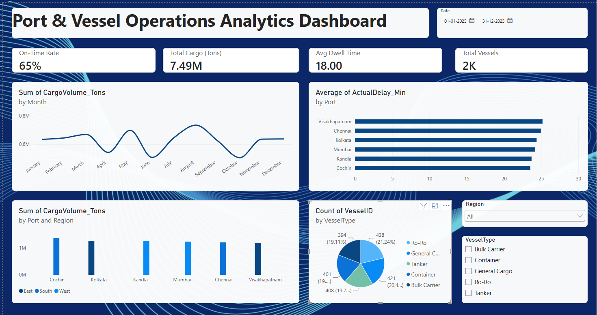
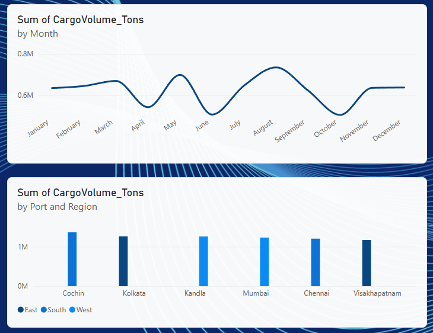
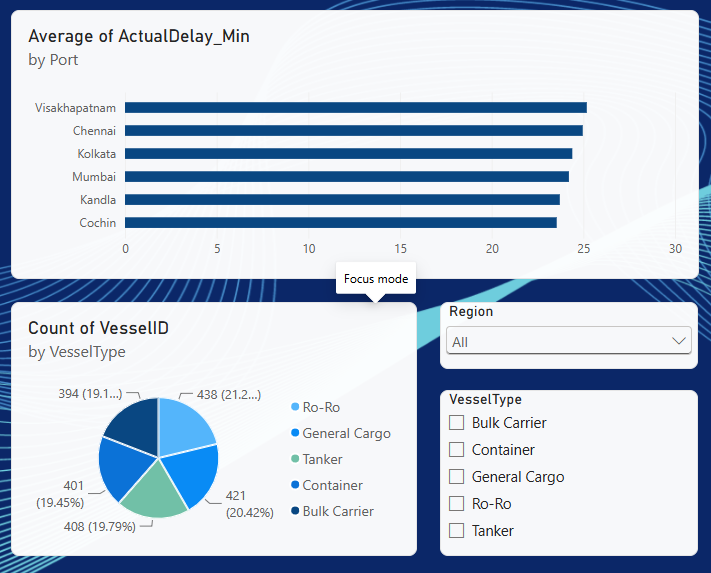

# port-vessel-analytics-dashboard
Interactive Power BI dashboard analyzing vessel delays, cargo throughput, and port performance across 6 Indian ports, with custom DAX measures and KPI tracking.
# Port & Vessel Operations Analytics Dashboard

An interactive Power BI dashboard analyzing vessel arrivals, cargo throughput, and delay patterns across 6 Indian ports, built to practice end-to-end BI workflow: data modelling, DAX measures, and dashboard design.

## Overview

The dashboard tracks vessel-level operations data — arrival delays, cargo volume, dwell time, and fuel consumption — across Mumbai, Chennai, Kolkata, Kandla, Visakhapatnam, and Cochin over a full year. It's designed to answer questions like: which ports are consistently delayed, how does cargo volume trend month over month, and how is vessel traffic distributed across regions and vessel types.

## Dashboard







## Key features

- **KPI cards** — On-Time Rate, Total Cargo (Tons), Avg Dwell Time, Total Vessels
- **Monthly cargo volume trend** — line chart showing seasonal variation
- **Average delay by port** — horizontal bar chart ranking ports by delay severity
- **Cargo volume by port and region** — column chart with East/South/West breakdown
- **Vessel type distribution** — pie chart across Bulk Carrier, Container, General Cargo, Ro-Ro, and Tanker
- **Interactive slicers** — filter by date range, region, and vessel type

## DAX measures

```
On-Time Rate = DIVIDE(COUNTROWS(FILTER('port_vessel_operations',[OnTime]=TRUE())),COUNTROWS('port_vessel_operations'))
Total Vessels = DISTINCTCOUNT('port_vessel_operations'[VesselID])
Avg Dwell Time = AVERAGE('port_vessel_operations'[DwellTime_Hours])
Total Cargo (Tons) = SUM('port_vessel_operations'[CargoVolume_Tons])
```

## Tools used

Power BI Desktop, DAX, Power Query

## Dataset

The dataset (`port_vessel_operations.csv`) is synthetically generated to simulate realistic port and vessel operations data, used here purely to practice the analytics and BI workflow — it does not represent real operational records.

## Files

- `port_vessel_operations.csv` — source dataset
- `Port_Vessel_Operations_Dashboard.pbix` — Power BI report file
- `dashboard_.png` — full dashboard overview
- `charts.png` — cargo volume trend and regional breakdown
- `Screenshot2.png` — delay by port and vessel type distribution
